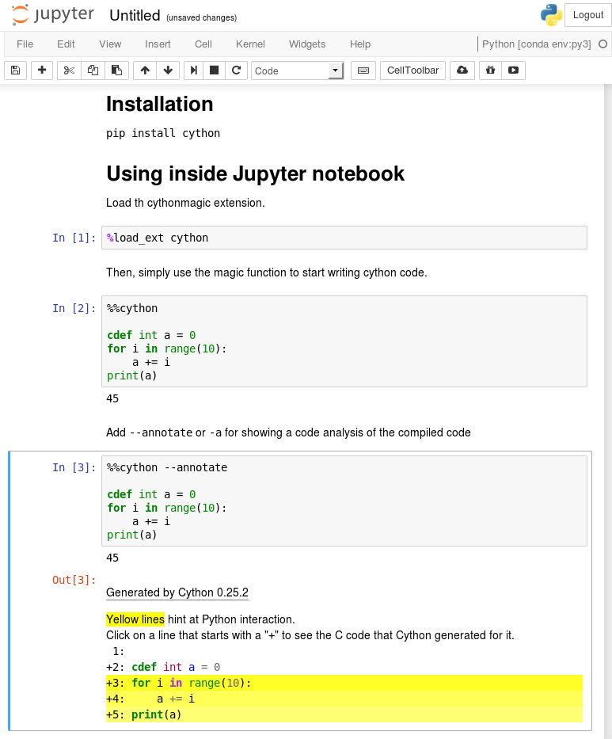

Building Cython code
====================

Cython code must, unlike Python, be compiled. This happens in two stages:

 - A ``.pyx`` or ``.py`` file is compiled by Cython to a ``.c`` file, containing
   the code of a Python extension module.
 - The ``.c`` file is compiled by a C compiler to
   a ``.so`` file (or ``.pyd`` on Windows) which can be
   ``import``-ed directly into a Python session.
   `setuptools <https://setuptools.readthedocs.io/>`_ takes care of this part.
   Although Cython can call them for you in certain cases.
   
To understand fully the Cython + setuptools build process,
one may want to read more about
`distributing Python modules <https://packaging.python.org/en/latest/tutorials/packaging-projects/>`_.

There are several ways to build Cython code:

 - Write a setuptools ``setup.py``. This is the normal and recommended way.
 - Run the ``cythonize`` command-line utility. This is a good approach for
   compiling a single Cython source file directly to an extension.
   A source file can be built "in place" (so that the extension module is created
   next to the source file, ready to be imported) with ``cythonize -i filename.pyx``.
 - Use :ref:`Pyximport<pyximport>`, importing Cython ``.pyx`` files as if they
   were ``.py`` files (using setuptools to compile and build in the background).
   This method is easier than writing a ``setup.py``, but is not very flexible.
   So you'll need to write a ``setup.py`` if, for example, you need certain compilations options.
 - Run the ``cython`` command-line utility manually to produce the ``.c`` file
   from the ``.pyx`` file, then manually compiling the ``.c`` file into a shared
   object library or DLL suitable for import from Python.
   (These manual steps are mostly for debugging and experimentation.)
 - Use the [Jupyter]_ notebook or the [Sage]_ notebook,
   both of which allow Cython code inline.
   This is the easiest way to get started writing Cython code and running it.

Currently, using setuptools is the most common way Cython files are built and distributed.
The other methods are described in more detail in the :ref:`compilation` section of the reference manual.

Building a Cython module using setuptools
-----------------------------------------

Imagine a simple "hello world" script in a file ``hello.pyx``:

.. literalinclude:: ../../examples/quickstart/build/hello.pyx

The following could be a corresponding ``setup.py`` script:

.. literalinclude:: ../../examples/quickstart/build/setup.py

To build, run ``python setup.py build_ext --inplace``.  Then simply
start a Python session and do ``from hello import say_hello_to`` and
use the imported function as you see fit.

.. _jupyter-notebook:

Using the Jupyter notebook
--------------------------

Cython can be used conveniently and interactively from a web browser
through the Jupyter notebook.  To install Jupyter notebook, e.g. into a virtualenv,
use pip:

.. code-block:: bash

    (venv)$ pip install jupyter
    (venv)$ jupyter notebook

To enable support for Cython compilation, install Cython as described in :ref:`the installation guide<install>`
and load the ``Cython`` extension from within the Jupyter notebook::

    %load_ext Cython

Then, prefix a cell with the ``%%cython`` marker to compile it

.. tabs::

    .. group-tab:: Pure Python

        .. code-block:: python

            %%cython

            a: cython.int = 0
            for i in range(10):
                a += i
            print(a)

    .. group-tab:: Cython

        .. code-block:: python

            %%cython

            cdef int a = 0
            for i in range(10):
                a += i
            print(a)

You can show Cython's code analysis by passing the ``--annotate`` option::

    %%cython --annotate
    ...

For more information about the arguments of the ``%%cython`` magic, see
:ref:`Compiling with a Jupyter Notebook <compiling_notebook>`.

Using the Sage notebook
-----------------------

   For users of the SageMath distribution, the Sage notebook uses Jupyter by default.
   Sage provides its own implementation of the ``%%cython`` cell magic (see
   `Sage Magics <https://doc.sagemath.org/html/en/reference/repl/sage/repl/ipython_extension.html#sage.repl.ipython_extension.SageMagics.cython>`_)
   which is loaded by default.
   Alternatively, you can overwrite it with the implementation provided by Cython,
   the procedure outlined for Jupyter notebooks also applies.

.. [Jupyter] https://jupyter.org/
..
   [Sage] W. Stein et al., Sage Mathematics Software, https://www.sagemath.org/
