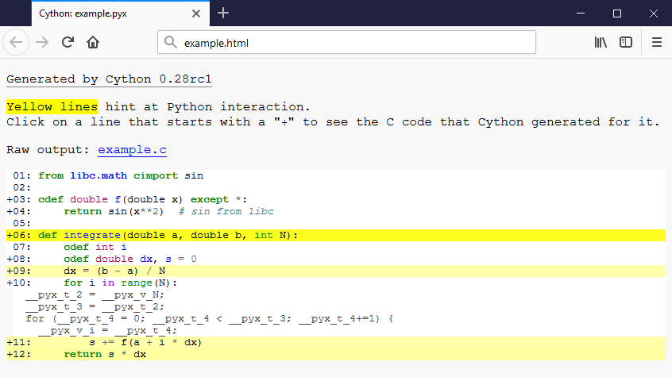

Faster code via static typing
=============================

Cython is a Python compiler.  This means that it can compile normal
Python code without changes (with a few obvious exceptions of some as-yet
unsupported language features, see :ref:`Cython limitations<cython-limitations>`).
However, for performance critical code, it is often helpful to add
static type declarations, as they will allow Cython to step out of the
dynamic nature of the Python code and generate simpler and faster C code
- sometimes faster by orders of magnitude.

It must be noted, however, that type declarations can make the source
code more verbose and thus less readable.  It is therefore discouraged
to use them without good reason, such as where benchmarks prove
that they really make the code substantially faster in a performance
critical section. Typically a few types in the right spots go a long way.

All C types are available for type declarations: integer and floating
point types, complex numbers, structs, unions and pointer types.
Cython can automatically and correctly convert between the types on
assignment.  This also includes Python's arbitrary size integer types,
where value overflows on conversion to a C type will raise a Python
``OverflowError`` at runtime.  (It does not, however, check for overflow
when doing arithmetic.) The generated C code will handle the
platform dependent sizes of C types correctly and safely in this case.

Types are declared via the cdef keyword.

Typing Variables
----------------

Consider the following pure Python code:

.. literalinclude:: ../../examples/quickstart/cythonize/integrate.py

Simply compiling this in Cython merely gives a 35% speedup.  This is
better than nothing, but adding some static types can make a much larger
difference.

With additional type declarations, this might look like:

.. literalinclude:: ../../examples/quickstart/cythonize/integrate_cy.pyx

Since the iterator variable ``i`` is typed with C semantics, the for-loop will be compiled
to pure C code.  Typing ``a``, ``s`` and ``dx`` is important as they are involved
in arithmetic within the for-loop; typing ``b`` and ``N`` makes less of a
difference, but in this case it is not much extra work to be
consistent and type the entire function.

This results in a 4 times speedup over the pure Python version.

Typing Functions
----------------

Python function calls can be expensive -- in Cython doubly so because
one might need to convert to and from Python objects to do the call.
In our example above, the argument is assumed to be a C double both inside f()
and in the call to it, yet a Python ``float`` object must be constructed around the
argument in order to pass it.

Therefore Cython provides a syntax for declaring a C-style function,
the cdef keyword:

.. literalinclude:: ../../examples/quickstart/cythonize/cdef_keyword.pyx

Some form of except-modifier should usually be added, otherwise Cython
will not be able to propagate exceptions raised in the function (or a
function it calls). The ``except? -2`` means that an error will be checked
for if ``-2`` is returned (though the ``?`` indicates that ``-2`` may also
be used as a valid return value).
Alternatively, the slower ``except *`` is always
safe. An except clause can be left out if the function returns a Python
object or if it is guaranteed that an exception will not be raised
within the function call.

A side-effect of cdef is that the function is no longer available from
Python-space, as Python wouldn't know how to call it. It is also no
longer possible to change :func:`f` at runtime.

Using the ``cpdef`` keyword instead of ``cdef``, a Python wrapper is also
created, so that the function is available both from Cython (fast, passing
typed values directly) and from Python (wrapping values in Python
objects). In fact, ``cpdef`` does not just provide a Python wrapper, it also
installs logic to allow the method to be overridden by python methods, even
when called from within cython. This does add a tiny overhead compared to ``cdef``
methods.

Speedup: 150 times over pure Python.

.. _determining_where_to_add_types:

Determining where to add types
------------------------------

Because static typing is often the key to large speed gains, beginners
often have a tendency to type everything in sight. This cuts down on both
readability and flexibility, and can even slow things down (e.g. by adding
unnecessary type checks, conversions, or slow buffer unpacking).
On the other hand, it is easy to kill
performance by forgetting to type a critical loop variable. Two essential
tools to help with this task are profiling and annotation.
Profiling should be the first step of any optimization effort, and can
tell you where you are spending your time. Cython's annotation can then
tell you why your code is taking time.

Using the ``-a`` switch to the ``cython`` command line program (or
following a link from the Sage notebook) results in an HTML report
of Cython code interleaved with the generated C code.  Lines are
colored according to the level of "typedness" --
white lines translate to pure C,
while lines that require the Python C-API are yellow
(darker as they translate to more C-API interaction).
Lines that translate to C code have a plus (``+``) in front
and can be clicked to show the generated code.

This report is invaluable when optimizing a function for speed,
and for determining when to :ref:`release the GIL <nogil>`:
in general, a ``nogil`` block may contain only "white" code.

Note that Cython deduces the type of local variables based on their assignments
(including as loop variable targets) which can also cut down on the need to
explicitly specify types everywhere.
For example, declaring ``dx`` to be of type double above is unnecessary,
as is declaring the type of ``s`` in the last version (where the return type
of ``f`` is known to be a C double.)  A notable exception, however, is
*integer types used in arithmetic expressions*, as Cython is unable to ensure
that an overflow would not occur (and so falls back to ``object`` in case
Python's bignums are needed).  To allow inference of C integer types, set the
``infer_types`` :ref:`directive <compiler-directives>` to ``True``. This directive
does a work similar to the ``auto`` keyword in C++ for the readers who are familiar
with this language feature. It can be of great help to cut down on the need to type
everything, but it also can lead to surprises. Especially if one isn't familiar with
arithmetic expressions with c types. A quick overview of those
can be found `here <https://www.eskimo.com/~scs/cclass/int/sx4cb.html>`_.

