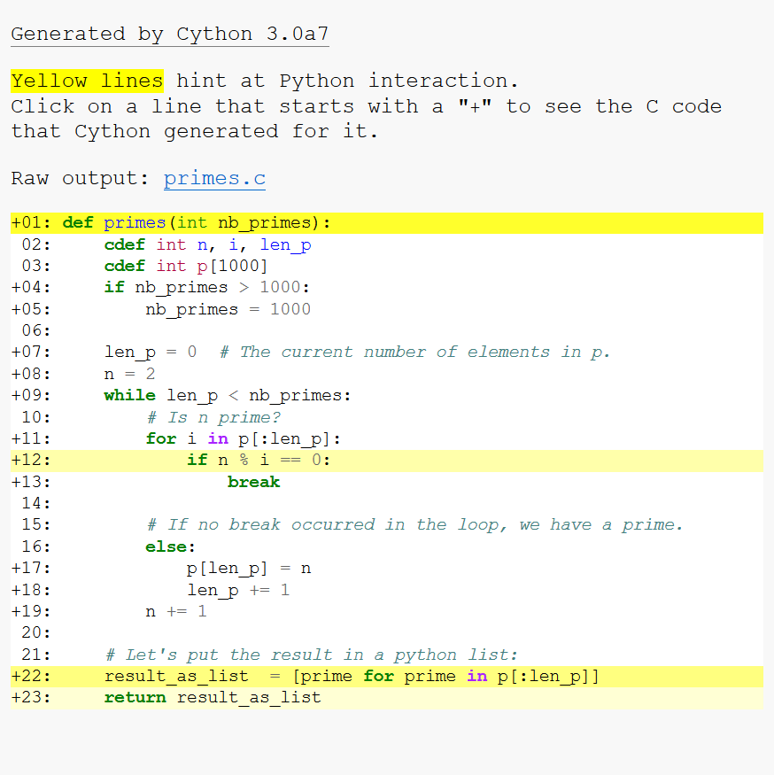

.. highlight:: cython

.. _tutorial:

**************
Basic Tutorial
**************

The Basics of Cython
====================

The fundamental nature of Cython can be summed up as follows: Cython is Python
with C data types.

Cython is Python: Almost any piece of Python code is also valid Cython code.
(There are a few :ref:`cython-limitations`, but this approximation will
serve for now.) The Cython compiler will convert it into C code which makes
equivalent calls to the Python/C API.

But Cython is much more than that, because parameters and variables can be
declared to have C data types. Code which manipulates Python values and C
values can be freely intermixed, with conversions occurring automatically
wherever possible. Reference count maintenance and error checking of Python
operations is also automatic, and the full power of Python's exception
handling facilities, including the try-except and try-finally statements, is
available to you -- even in the midst of manipulating C data.

Cython Hello World
===================

As Cython can accept almost any valid python source file, one of the hardest
things in getting started is just figuring out how to compile your extension.

So lets start with the canonical python hello world::

    print("Hello World")

Save this code in a file named :file:`helloworld.pyx`.  Now we need to create
the :file:`setup.py`, which is like a python Makefile (for more information
see :ref:`compilation`). Your :file:`setup.py` should look like::

    from distutils.core import setup
    from Cython.Build import cythonize

    setup(
        ext_modules = cythonize("helloworld.pyx")
    )

To use this to build your Cython file use the commandline options:

.. sourcecode:: text

    $ python setup.py build_ext --inplace

Which will leave a file in your local directory called :file:`helloworld.so` in unix
or :file:`helloworld.pyd` in Windows. Now to use this file: start the python
interpreter and simply import it as if it was a regular python module::

    >>> import helloworld
    Hello World

Congratulations! You now know how to build a Cython extension. But so far
this example doesn't really give a feeling why one would ever want to use Cython, so
lets create a more realistic example.

:mod:`pyximport`: Cython Compilation for Developers
---------------------------------------------------

If your module doesn't require any extra C libraries or a special
build setup, then you can use the pyximport module, originally developed
by Paul Prescod, to load .pyx files directly on import, without having
to run your :file:`setup.py` file each time you change your code.
It is shipped and installed with Cython and can be used like this::

    >>> import pyximport; pyximport.install()
    >>> import helloworld
    Hello World

The :ref:`Pyximport<pyximport>` module also has experimental
compilation support for normal Python modules.  This allows you to
automatically run Cython on every .pyx and .py module that Python
imports, including the standard library and installed packages.
Cython will still fail to compile a lot of Python modules, in which
case the import mechanism will fall back to loading the Python source
modules instead.  The .py import mechanism is installed like this::

    >>> pyximport.install(pyimport=True)

Note that it is not recommended to let :ref:`Pyximport<pyximport>` build code
on end user side as it hooks into their import system.  The best way
to cater for end users is to provide pre-built binary packages in the
`wheel <https://wheel.readthedocs.io/>`_ packaging format.

Fibonacci Fun
==============

From the official Python tutorial a simple fibonacci function is defined as:

.. literalinclude:: ../../examples/tutorial/cython_tutorial/fib.pyx

Now following the steps for the Hello World example we first rename the file
to have a `.pyx` extension, lets say :file:`fib.pyx`, then we create the
:file:`setup.py` file. Using the file created for the Hello World example, all
that you need to change is the name of the Cython filename, and the resulting
module name, doing this we have:

.. literalinclude:: ../../examples/tutorial/cython_tutorial/setup.py

Build the extension with the same command used for the helloworld.pyx:

.. sourcecode:: text

    $ python setup.py build_ext --inplace

And use the new extension with::

    >>> import fib
    >>> fib.fib(2000)
    1 1 2 3 5 8 13 21 34 55 89 144 233 377 610 987 1597

.. _primes:

Primes
=======

Here's a small example showing some of what can be done. It's a routine for
finding prime numbers. You tell it how many primes you want, and it returns
them as a Python list.

:file:`primes.pyx`:

.. literalinclude:: ../../examples/tutorial/cython_tutorial/primes.pyx
    :linenos:

You'll see that it starts out just like a normal Python function definition,
except that the parameter ``nb_primes`` is declared to be of type ``int`` . This
means that the object passed will be converted to a C integer (or a
``TypeError.`` will be raised if it can't be).

Now, let's dig into the core of the function::

    cdef int n, i, len_p
    cdef int p[1000]

Lines 2 and 3 use the ``cdef`` statement to define some local C variables.
The result is stored in the C array ``p`` during processing,
and will be copied into a Python list at the end (line 22).

.. NOTE:: You cannot create very large arrays in this manner, because
          they are allocated on the C function call stack, which is a
          rather precious and scarce resource.
          To request larger arrays,
          or even arrays with a length only known at runtime,
          you can learn how to make efficient use of
          :ref:`C memory allocation <memory_allocation>`,
          :ref:`Python arrays <array-array>`
          or :ref:`NumPy arrays <memoryviews>` with Cython.

::

    if nb_primes > 1000:
        nb_primes = 1000

As in C, declaring a static array requires knowing the size at compile time.
We make sure the user doesn't set a value above 1000 (or we would have a
segmentation fault, just like in C).  ::

    len_p = 0  # The number of elements in p
    n = 2
    while len_p < nb_primes:

Lines 7-9 set up for a loop which will test candidate numbers for primeness
until the required number of primes has been found. ::

    # Is n prime?
    for i in p[:len_p]:
        if n % i == 0:
            break

Lines 11-12, which try dividing a candidate by all the primes found so far,
are of particular interest. Because no Python objects are referred to,
the loop is translated entirely into C code, and thus runs very fast.
You will notice the way we iterate over the ``p`` C array.  ::

    for i in p[:len_p]:

The loop gets translated into a fast C loop and works just like iterating
over a Python list or NumPy array.  If you don't slice the C array with
``[:len_p]``, then Cython will loop over the 1000 elements of the array.

::

    # If no break occurred in the loop
    else:
        p[len_p] = n
        len_p += 1
    n += 1

If no breaks occurred, it means that we found a prime, and the block of code
after the ``else`` line 16 will be executed. We add the prime found to ``p``.
If you find having an ``else`` after a for-loop strange, just know that it's a
lesser known features of the Python language, and that Cython executes it at
C speed for you.
If the for-else syntax confuses you, see this excellent
`blog post <https://shahriar.svbtle.com/pythons-else-clause-in-loops>`_.

::

    # Let's put the result in a python list:
    result_as_list  = [prime for prime in p[:len_p]]
    return result_as_list

In line 22, before returning the result, we need to copy our C array into a
Python list, because Python can't read C arrays.  Cython can automatically
convert many C types from and to Python types, as described in the
documentation on :ref:`type conversion <type-conversion>`, so we can use
a simple list comprehension here to copy the C ``int`` values into a Python
list of Python ``int`` objects, which Cython creates automatically along the way.
You could also have iterated manually over the C array and used
``result_as_list.append(prime)``, the result would have been the same.

You'll notice we declare a Python list exactly the same way it would be in Python.
Because the variable ``result_as_list`` hasn't been explicitly declared with a type,
it is assumed to hold a Python object, and from the assignment, Cython also knows
that the exact type is a Python list.

Finally, at line 18, a normal
Python return statement returns the result list.

Compiling primes.pyx with the Cython compiler produces an extension module
which we can try out in the interactive interpreter as follows::

    >>> import primes
    >>> primes.primes(10)
    [2, 3, 5, 7, 11, 13, 17, 19, 23, 29]

See, it works! And if you're curious about how much work Cython has saved you,
take a look at the C code generated for this module.

Cython has a way to visualise where interaction with Python objects and
Python's C-API is taking place. For this, pass the
``annotate=True`` parameter to ``cythonize()``. It produces a HTML file. Let's see:

If a line is white, it means that the code generated doesn't interact
with Python, so will run as fast as normal C code.  The darker the yellow, the more
Python interaction there is in that line.  Those yellow lines will usually operate
on Python objects, raise exceptions, or do other kinds of higher-level operations
than what can easily be translated into simple and fast C code.
The function declaration and return use the Python interpreter so it makes
sense for those lines to be yellow. Same for the list comprehension because
it involves the creation of a Python object. But the line ``if n % i == 0:``, why?
We can examine the generated C code to understand:

.. figure:: python_division.png

We can see that some checks happen. Because Cython defaults to the
Python behavior, the language will perform division checks at runtime,
just like Python does. You can deactivate those checks by using the
:ref:`compiler directives<compiler-directives>`.

Now let's see if, even if we have division checks, we obtained a boost in speed.
Let's write the same program, but Python-style:

.. literalinclude:: ../../examples/tutorial/cython_tutorial/primes_python.py

It is also possible to take a plain ``.py`` file and to compile it with Cython.
Let's take ``primes_python``, change the function name to ``primes_python_compiled`` and
compile it with Cython (without changing the code). We will also change the name of the
file to ``example_py_cy.py`` to differentiate it from the others.
Now the ``setup.py`` looks like this::

    from distutils.core import setup
    from Cython.Build import cythonize

    setup(
        ext_modules=cythonize(['example.pyx',        # Cython code file with primes() function
                               'example_py_cy.py'],  # Python code file with primes_python_compiled() function
                              annotate=True),        # enables generation of the html annotation file
    )

Now we can ensure that those two programs output the same values::

    >>> primes_python(1000) == primes(1000)
    True
    >>> primes_python_compiled(1000) == primes(1000)
    True

It's possible to compare the speed now::

    python -m timeit -s 'from example_py import primes_python' 'primes_python(1000)'
    10 loops, best of 3: 23 msec per loop

    python -m timeit -s 'from example_py_cy import primes_python_compiled' 'primes_python_compiled(1000)'
    100 loops, best of 3: 11.9 msec per loop

    python -m timeit -s 'from example import primes' 'primes(1000)'
    1000 loops, best of 3: 1.65 msec per loop

The cythonize version of ``primes_python`` is 2 times faster than the Python one,
without changing a single line of code.
The Cython version is 13 times faster than the Python version! What could explain this?

Multiple things:
 * In this program, very little computation happen at each line.
   So the overhead of the python interpreter is very important. It would be
   very different if you were to do a lot computation at each line. Using NumPy for
   example.
 * Data locality. It's likely that a lot more can fit in CPU cache when using C than
   when using Python. Because everything in python is an object, and every object is
   implemented as a dictionary, this is not very cache friendly.

Usually the speedups are between 2x to 1000x. It depends on how much you call
the Python interpreter. As always, remember to profile before adding types
everywhere. Adding types makes your code less readable, so use them with
moderation.

Primes with C++
===============

With Cython, it is also possible to take advantage of the C++ language, notably,
part of the C++ standard library is directly importable from Cython code.

Let's see what our :file:`primes.pyx` becomes when
using `vector <https://en.cppreference.com/w/cpp/container/vector>`_ from the C++
standard library.

.. note::

    Vector in C++ is a data structure which implements a list or stack based
    on a resizeable C array. It is similar to the Python ``array``
    type in the ``array`` standard library module.
    There is a method `reserve` available which will avoid copies if you know in advance
    how many elements you are going to put in the vector. For more details
    see `this page from cppreference <https://en.cppreference.com/w/cpp/container/vector>`_.

.. literalinclude:: ../../examples/tutorial/cython_tutorial/primes_cpp.pyx
    :linenos:

The first line is a compiler directive. It tells Cython to compile your code to C++.
This will enable the use of C++ language features and the C++ standard library.
Note that it isn't possible to compile Cython code to C++ with `pyximport`. You
should use a :file:`setup.py` or a notebook to run this example.

You can see that the API of a vector is similar to the API of a Python list,
and can sometimes be used as a drop-in replacement in Cython.

For more details about using C++ with Cython, see :ref:`wrapping-cplusplus`.

Language Details
================

For more about the Cython language, see :ref:`language-basics`.
To dive right in to using Cython in a numerical computation context,
see :ref:`memoryviews`.

