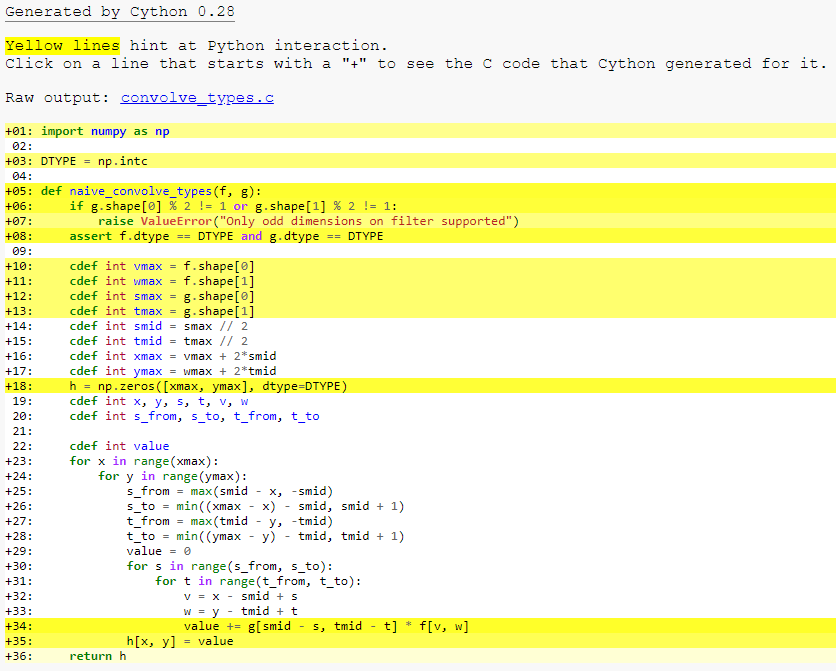

.. highlight:: cython

.. _numpy_tutorial:

**************************
Cython for NumPy users
**************************

This tutorial is aimed at NumPy users who have no experience with Cython at
all. If you have some knowledge of Cython you may want to skip to the
''Efficient indexing'' section.

The main scenario considered is NumPy end-use rather than NumPy/SciPy
development. The reason is that Cython is not (yet) able to support functions
that are generic with respect to the number of dimensions in a
high-level fashion. This restriction is much more severe for SciPy development
than more specific, "end-user" functions. See the last section for more
information on this.

The style of this tutorial will not fit everybody, so you can also consider:

* Kurt Smith's `video tutorial of Cython at SciPy 2015
  <https://www.youtube.com/watch?v=gMvkiQ-gOW8&t=4730s&ab_channel=Enthought>`_.
  The slides and notebooks of this talk are `on github
  <https://github.com/kwmsmith/scipy-2015-cython-tutorial>`_.
* Basic Cython documentation (see `Cython front page
  <https://cython.readthedocs.io/en/latest/index.html>`_).

Cython at a glance
==================

Cython is a compiler which compiles Python-like code files to C code. Still,
''Cython is not a Python to C translator''. That is, it doesn't take your full
program and "turns it into C" -- rather, the result makes full use of the
Python runtime environment. A way of looking at it may be that your code is
still Python in that it runs within the Python runtime environment, but rather
than compiling to interpreted Python bytecode one compiles to native machine
code (but with the addition of extra syntax for easy embedding of faster
C-like code).

This has two important consequences:

* Speed. How much depends very much on the program involved though. Typical Python numerical programs would tend to gain very little as most time is spent in lower-level C that is used in a high-level fashion. However for-loop-style programs can gain many orders of magnitude, when typing information is added (and is so made possible as a realistic alternative).
* Easy calling into C code. One of Cython's purposes is to allow easy wrapping
  of C libraries. When writing code in Cython you can call into C code as
  easily as into Python code.

Very few Python constructs are not yet supported, though making Cython compile all
Python code is a stated goal, you can see the differences with Python in
:ref:`limitations <cython-limitations>`.

Your Cython environment
=======================

Using Cython consists of these steps:

1. Write a :file:`.pyx` source file
2. Run the Cython compiler to generate a C file
3. Run a C compiler to generate a compiled library
4. Run the Python interpreter and ask it to import the module

However there are several options to automate these steps:

1. The `SAGE <http://sagemath.org>`_ mathematics software system provides
   excellent support for using Cython and NumPy from an interactive command
   line or through a notebook interface (like
   Maple/Mathematica). See `this documentation
   <http://doc.sagemath.org/html/en/developer/coding_in_cython.html>`_.
2. Cython can be used as an extension within a Jupyter notebook,
   making it easy to compile and use Cython code with just a ``%%cython``
   at the top of a cell. For more information see
   :ref:`Using the Jupyter Notebook <jupyter-notebook>`.
3. A version of pyximport is shipped with Cython,
   so that you can import pyx-files dynamically into Python and
   have them compiled automatically (See :ref:`pyximport`).
4. Cython supports distutils so that you can very easily create build scripts
   which automate the process, this is the preferred method for
   Cython implemented libraries and packages.
   See :ref:`Compiling with distutils <compiling-distutils>`.
5. Manual compilation (see below)

.. Note::
    If using another interactive command line environment than SAGE, like
    IPython or Python itself, it is important that you restart the process
    when you recompile the module. It is not enough to issue an "import"
    statement again.

Installation
=============

If you already have a C compiler, just do::

   pip install Cython

otherwise, see :ref:`the installation page <install>`.

As of this writing SAGE comes with an older release of Cython than required
for this tutorial. So if using SAGE you should download the newest Cython and
then execute ::

    $ cd path/to/cython-distro
    $ path-to-sage/sage -python setup.py install

This will install the newest Cython into SAGE.

Manual compilation
====================

As it is always important to know what is going on, I'll describe the manual
method here. First Cython is run::

    $ cython yourmod.pyx

This creates :file:`yourmod.c` which is the C source for a Python extension
module. A useful additional switch is ``-a`` which will generate a document
:file:`yourmod.html`) that shows which Cython code translates to which C code
line by line.

Then we compile the C file. This may vary according to your system, but the C
file should be built like Python was built. Python documentation for writing
extensions should have some details. On Linux this often means something
like::

    $ gcc -shared -pthread -fPIC -fwrapv -O2 -Wall -fno-strict-aliasing -I/usr/include/python2.7 -o yourmod.so yourmod.c

``gcc`` should have access to the NumPy C header files so if they are not
installed at :file:`/usr/include/numpy` or similar you may need to pass another
option for those. You only need to provide the NumPy headers if you write::

    cimport numpy

in your Cython code.

This creates :file:`yourmod.so` in the same directory, which is importable by
Python by using a normal ``import yourmod`` statement.

The first Cython program
==========================

The code below does 2D discrete convolution of an image with a filter (and I'm
sure you can do better!, let it serve for demonstration purposes). It is both
valid Python and valid Cython code. I'll refer to it as both
:file:`convolve_py.py` for the Python version and :file:`convolve_cy.pyx` for the
Cython version -- Cython uses ".pyx" as its file suffix.

.. literalinclude:: ../../examples/memoryviews/convolve_py.py
    :linenos:

This should be compiled to produce :file:`convolve_cy.so` (for Linux systems). We
run a Python session to test both the Python version (imported from
``.py``-file) and the compiled Cython module.

.. sourcecode:: ipython

    In [1]: import numpy as np
    In [2]: import convolve_py
    In [3]: convolve_py.naive_convolve(np.array([[1, 1, 1]], dtype=np.int),
    ...     np.array([[1],[2],[1]], dtype=np.int))
    Out [3]:
    array([[1, 1, 1],
        [2, 2, 2],
        [1, 1, 1]])
    In [4]: import convolve_cy
    In [4]: convolve_cy.naive_convolve(np.array([[1, 1, 1]], dtype=np.int),
    ...     np.array([[1],[2],[1]], dtype=np.int))
    Out [4]:
    array([[1, 1, 1],
        [2, 2, 2],
        [1, 1, 1]])
    In [11]: N = 600
    In [12]: f = np.arange(N*N, dtype=np.int).reshape((N,N))
    In [13]: g = np.arange(81, dtype=np.int).reshape((9, 9))
    In [19]: %timeit convolve_py.naive_convolve(f, g)
    16 s ± 70.7 ms per loop (mean ± std. dev. of 7 runs, 1 loop each)
    In [20]: %timeit convolve_cy.naive_convolve(f, g)
    13.5 s ± 99.5 ms per loop (mean ± std. dev. of 7 runs, 1 loop each)

There's not such a huge difference yet; because the C code still does exactly
what the Python interpreter does (meaning, for instance, that a new object is
allocated for each number used).

You can look at the Python interaction and the generated C
code by using ``-a`` when calling Cython from the command
line, ``%%cython -a`` when using a Jupyter Notebook, or by using
``cythonize('convolve_cy.pyx', annotate=True)`` when using a ``setup.py``.
Look at the generated html file and see what
is needed for even the simplest statements. You get the point quickly. We need
to give Cython more information; we need to add types.

Adding types
=============

To add types we use custom Cython syntax, so we are now breaking Python source
compatibility. Here's :file:`convolve_typed.pyx`. *Read the comments!*

.. literalinclude:: ../../examples/memoryviews/convolve_typed.pyx
    :linenos:

At this point, have a look at the generated C code for :file:`convolve_cy.pyx` and
:file:`convolve_typed.pyx`. Click on the lines to expand them and see corresponding C.

Especially have a look at the ``for-loops``: In :file:`convolve_cy.c`, these are ~20 lines
of C code to set up while in :file:`convolve_typed.c` a normal C for loop is used.

After building this and continuing my (very informal) benchmarks, I get:

.. sourcecode:: ipython

    In [22]: %timeit convolve_typed.naive_convolve(f, g)
    55.8 s ± 199 ms per loop (mean ± std. dev. of 7 runs, 1 loop each)

So in the end, adding types make the Cython code slower?

What happened is that most of the time spend in this code is spent on line
54. ::

    value += g[smid - s, tmid - t] * f[v, w]

So what made this line so much slower than in the pure Python version?

``g`` and ``f`` are still NumPy arrays, so Python objects, and expect
Python integers as indexes. Here we pass C int values. So every time
Cython reaches this line, it has to convert all the C integers to Python
int objects. Since this line is called very often, it outweighs the speed
benefits of the pure C loops that were created from the ``range()`` earlier.

Furthermore, ``g[smid - s, tmid - t] * f[v, w]`` returns a Python integer
and ``value`` is a C integer, so Cython has to do type conversions again.
In the end those types conversions add up. And made our convolution really
slow. But this problem can be solved easily by using memoryviews.

Efficient indexing with memoryviews
===================================

There are still two bottlenecks that degrade the performance, and that is the array lookups
and assignments, as well as C/Python types conversion.
The ``[]``-operator still uses full Python operations --
what we would like to do instead is to access the data buffer directly at C
speed.

What we need to do then is to type the contents of the :obj:`ndarray` objects.
We do this with a memoryview. There is :ref:`a page in the Cython documentation
<memoryviews>` dedicated to it.

In short, memoryviews are C structures that can hold a pointer to the data
of a NumPy array and all the necessary buffer metadata to provide efficient
and safe access: dimensions, strides, item size, item type information, etc...
They also support slices, so they work even if
the NumPy array isn't contiguous in memory.
They can be indexed by C integers, thus allowing fast access to the
NumPy array data.

Here is how to declare a memoryview of integers::

    cdef int [:] foo         # 1D memoryview
    cdef int [:, :] foo      # 2D memoryview
    cdef int [:, :, :] foo   # 3D memoryview
    ...                      # You get the idea.

No data is copied from the NumPy array to the memoryview in our example.
As the name implies, it is only a "view" of the memory. So we can use the
view ``h`` for efficient indexing and at the end return the real NumPy
array ``h_np`` that holds the data that we operated on.

Here is how to use them in our code:

:file:`convolve_memview.pyx`

.. literalinclude:: ../../examples/memoryviews/convolve_memview.pyx
    :linenos:

Let's see how much faster accessing is now.

.. sourcecode:: ipython

    In [22]: %timeit convolve_memview.naive_convolve(f, g)
    57.1 ms ± 268 µs per loop (mean ± std. dev. of 7 runs, 10 loops each)

Note the importance of this change.
We're now 280 times faster than an interpreted version of Python.

Memoryviews can be used with slices too, or even
with Python arrays. Check out the :ref:`memoryview page <memoryviews>` to
see what they can do for you.

Tuning indexing further
========================

The array lookups are still slowed down by two factors:

1. Bounds checking is performed.
2. Negative indices are checked for and handled correctly.  The code above is
   explicitly coded so that it doesn't use negative indices, and it
   (hopefully) always access within bounds.

    With decorators, we can deactivate those checks::

        ...
        cimport cython
        @cython.boundscheck(False)  # Deactivate bounds checking
        @cython.wraparound(False)   # Deactivate negative indexing.
        def naive_convolve(int [:, :] f, int [:, :] g):
        ...

Now bounds checking is not performed (and, as a side-effect, if you ''do''
happen to access out of bounds you will in the best case crash your program
and in the worst case corrupt data). It is possible to switch bounds-checking
mode in many ways, see :ref:`compiler-directives` for more
information.

.. sourcecode:: ipython

    In [23]: %timeit convolve_index.naive_convolve(f, g)
    19.8 ms ± 299 µs per loop (mean ± std. dev. of 7 runs, 100 loops each)

We're now 800 times faster than the interpreted Python version.

.. Warning::

    Speed comes with some cost. Especially it can be dangerous to set typed
    objects (like ``f``, ``g`` and ``h`` in our sample code) to ``None``.
    Setting such objects to ``None`` is entirely legal, but all you can do with them
    is check whether they are None. All other use (attribute lookup or indexing)
    can potentially segfault or corrupt data (rather than raising exceptions as
    they would in Python).

    The actual rules are a bit more complicated but the main message is clear: Do
    not use typed objects without knowing that they are not set to ``None``.

Declaring the NumPy arrays as contiguous
========================================

For extra speed gains, if you know that the NumPy arrays you are
providing are contiguous in memory, you can declare the
memoryview as contiguous.

We give an example on an array that has 3 dimensions.
If you want to give Cython the information that the data is C-contiguous
you have to declare the memoryview like this::

    cdef int [:,:,::1] a

If you want to give Cython the information that the data is Fortran-contiguous
you have to declare the memoryview like this::

    cdef int [::1, :, :] a

If all this makes no sense to you, you can skip this part, the performance gains are
not that important. If you still want to understand what contiguous arrays are
all about, you can see `this answer on StackOverflow
<https://stackoverflow.com/questions/26998223/what-is-the-difference-between-contiguous-and-non-contiguous-arrays>`_.

For the sake of giving numbers, here are the speed gains that you should
get by declaring the memoryviews as contiguous:

.. sourcecode:: ipython

    In [23]: %timeit convolve_contiguous.naive_convolve(f, g)
    21.3 ms ± 489 µs per loop (mean ± std. dev. of 7 runs, 10 loops each)

We're still around 800 times faster than the interpreted Python version.

Making the function cleaner
===========================

Declaring types can make your code quite verbose. If you don't mind
Cython inferring the C types of your variables, you can use
the ``infer_types=True`` compiler directive at the top of the file.
It will save you quite a bit of typing.

Note that since type declarations must happen at the top indentation level,
Cython won't infer the type of variables declared for the first time
in other indentation levels. It would change too much the meaning of
our code. This is why, we must still declare manually the type of the
``value`` variable.

And actually, manually giving the type of the ``value`` variable will
be useful when using fused types.

.. literalinclude:: ../../examples/memoryviews/convolve_infer_types.pyx
    :linenos:

We now do a speed test:

.. sourcecode:: ipython

    In [24]: %timeit convolve_infer_types.naive_convolve(f, g)
    21.3 ms ± 344 µs per loop (mean ± std. dev. of 7 runs, 10 loops each)

We're still around 800 times faster than the interpreted Python version.

More generic code
==================

All those speed gains are nice, but adding types constrains our code.
At the moment, it would mean that our function can only work with
NumPy arrays with the ``np.intc`` type. Is it possible to make our
code work for multiple NumPy data types?

Yes, with the help of a new feature called fused types.
You can learn more about it at :ref:`this section of the documentation
<fusedtypes>`.
It is similar to C++ 's templates. It generates multiple function declarations
at compile time, and then chooses the right one at run-time based on the
types of the arguments provided. By comparing types in if-conditions, it
is also possible to execute entirely different code paths depending
on the specific data type.

In our example, since we don't have access anymore to the NumPy's dtype
of our input arrays, we use those ``if-else`` statements to
know what NumPy data type we should use for our output array.

In this case, our function now works for ints, doubles and floats.

.. literalinclude:: ../../examples/memoryviews/convolve_fused_types.pyx
    :linenos:

We can check that the output type is the right one::

    >>>naive_convolve_fused_types(f, g).dtype
    dtype('int32')
    >>>naive_convolve_fused_types(f.astype(np.double), g.astype(np.double)).dtype
    dtype('float64')

We now do a speed test:

.. sourcecode:: ipython

    In [25]: %timeit convolve_fused_types.naive_convolve(f, g)
    20 ms ± 392 µs per loop (mean ± std. dev. of 7 runs, 10 loops each)

We're still around 800 times faster than the interpreted Python version.

Where to go from here?
======================

* Since there is no Python interaction in the loops, it is possible with Cython
  to release the GIL and use multiple cores easily. To learn how to do that,
  you can see :ref:`using parallelism in Cython <parallel>`.
* If you want to learn how to make use of `BLAS <http://www.netlib.org/blas/>`_
  or `LAPACK <http://www.netlib.org/lapack/>`_ with Cython, you can watch
  `the presentation of Ian Henriksen at SciPy 2015
  <https://www.youtube.com/watch?v=R4yB-8tB0J0&t=693s&ab_channel=Enthought>`_.
* If you want to learn how to use Pythran as backend in Cython, you
  can see how in :ref:`Pythran as a NumPy backend <numpy-pythran>`.
  Note that using Pythran only works with the
  :ref:`old buffer syntax <working-numpy>` and not yet with memoryviews.
